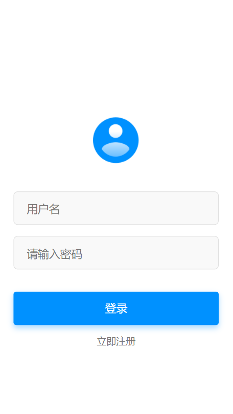
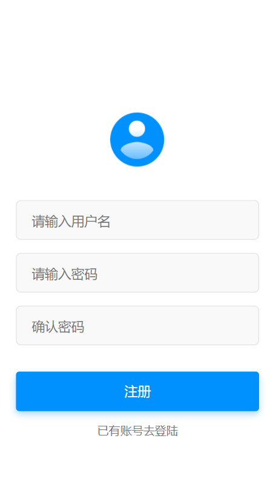
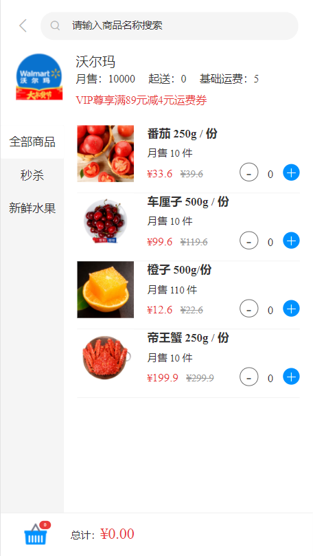
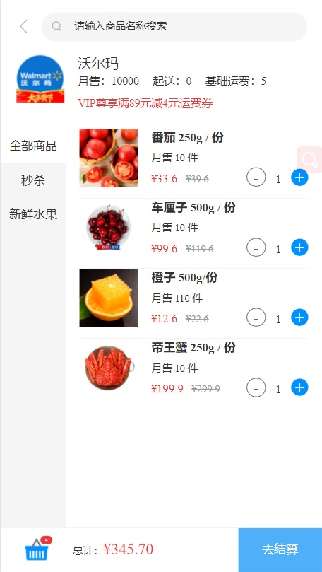
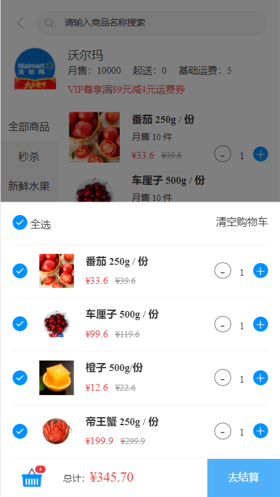
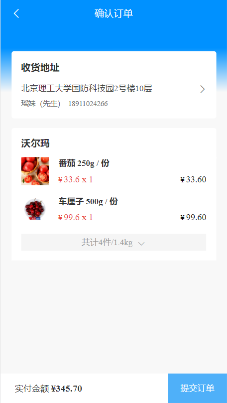
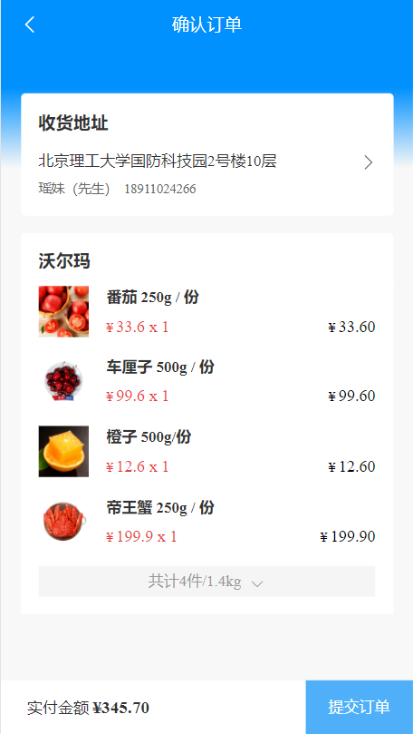
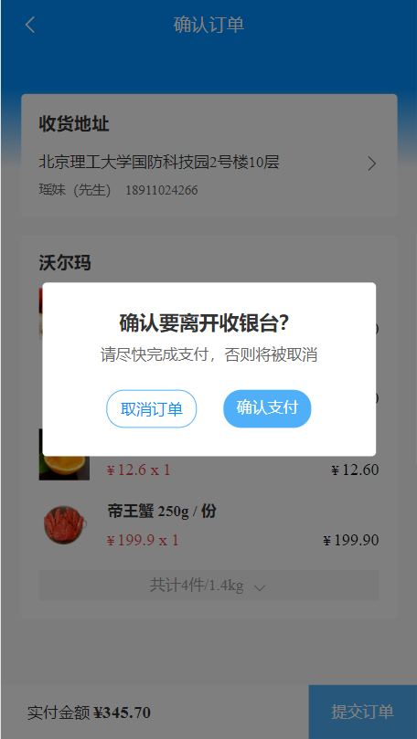
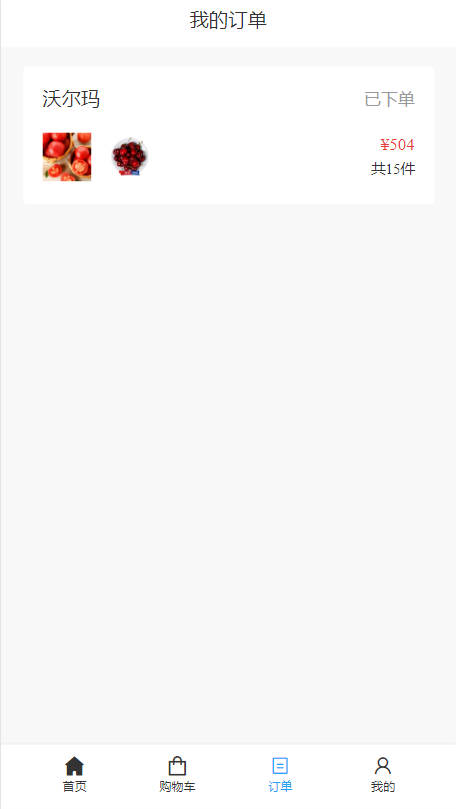

# Overview
A study program modeled after JD.The project is for learn Vue.
This is a `mobile website`.
# Feature
## Login

* Verify prompt for an empty account password
* Post a request to back-end，the home page is displayed when the back end returns correctly
* LocalStorage Stores user information to maintain login status
* The login page is displayed if the home page is accessed illegally
## Register

* Layout of register page
## Home

* Rendering of data returned from the back end
* Click on a nearby store to jump to the object store details page
## Shop



* Layout of shop page
* The data synchronization of the bottom shopping cart is calculated by item price
* Calculate the price of the item based on the selected state
* Item addition increases and decreases of button
* Click the settlement button to jump to the order page
* Pass the cart item information to the order confirmation page
## OrderConfirmation



* Render the received data and control the display of the product list through the extension button.
* Calculate commodity price
* Submit order button event
## OrderList

* Render the order data sent from the back end
# Stack Information
| Concern | Solution |
| :---: | :---: |
| Server | fastmock |
|UI Framework| Vue3|
|Stying | Sass |
# Setup
## Prerequisites
* Node
* Yarn
## Installation
##### First of all，download code by github 

```angular2html
git clone git@github.com:AlexL0ng/imitation-jingdong.git
```
#### Install dependecies

```angular2html
yarn add
```

#### Run serve

```angular2html
yarn serve
```
